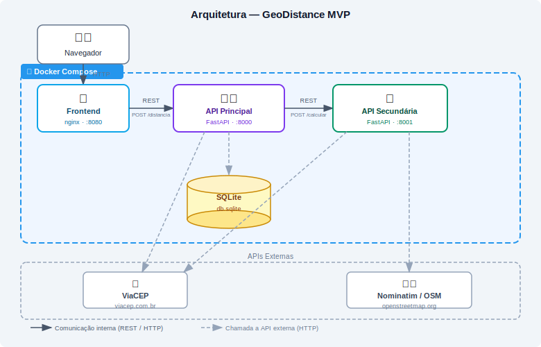

# GeoDistance — API Principal

API REST construída com **FastAPI** responsável por orquestrar o cálculo de distância entre dois CEPs brasileiros. Valida os CEPs via [ViaCEP](https://viacep.com.br), delega o cálculo à API secundária (Haversine) e persiste o histórico em SQLite.

---

## Arquitetura da Aplicação

O diagrama abaixo ilustra o fluxo completo desde a interação do usuário até o retorno da distância calculada.



---

## Tecnologias

| Tecnologia | Função |
|---|---|
| Python 3.11 | Linguagem |
| FastAPI | Framework web |
| Uvicorn | Servidor ASGI |
| SQLAlchemy | ORM / SQLite |
| Pydantic | Validação de dados |
| Requests | Chamadas HTTP externas |

---

## Estrutura

```
api-principal/
├── main.py          # Rotas e lógica principal
├── database.py      # Configuração do SQLite (SQLAlchemy)
├── models.py        # Modelo Historico
├── requirements.txt
└── Dockerfile
```

---

## Variáveis de ambiente

| Variável | Padrão | Descrição |
|---|---|---|
| `SECONDARY_API_URL` | `http://localhost:8001` | URL base da API secundária de cálculo |

No Docker Compose o valor é sobrescrito automaticamente para `http://api-secundaria:8001`.

---

## Endpoints

### `GET /cep/{cep}`
Consulta dados de endereço de um CEP diretamente no ViaCEP.

**Exemplo:** `GET /cep/01001000`

---

### `POST /distancia`
Calcula a distância em linha reta (Haversine) entre dois CEPs e salva o resultado no histórico.

**Body:**
```json
{
  "cep_origem": "22041001",
  "cep_destino": "01311000"
}
```

**Resposta 200:**
```json
{
  "distancia": "359.93 km",
  "origem": { "cep": "22041-001", "logradouro": "Avenida Atlântica", ... },
  "destino": { "cep": "01311-000", "logradouro": "Avenida Paulista", ... }
}
```

**Erros possíveis:**

| Código | Motivo |
|---|---|
| 400 | CEP com formato inválido (deve ter 8 dígitos) |
| 404 | CEP não encontrado no ViaCEP |
| 502 | Falha na comunicação com a API secundária |

---

### `PUT /historico/{id}`
Atualiza a distância de um registro do histórico.

**Body:** `{ "distancia": "350.00 km" }`

---

### `DELETE /historico/{id}`
Remove um registro do histórico.

---

## Instalação e execução

### Pré-requisitos

- Python 3.11+
- pip
- Docker e Docker Compose (opcional, para execução em containers)

### Opção 1: execução com Docker Compose (recomendado)

Na raiz do projeto `geo-distance-mvp/`:

```bash
docker compose up --build
```

### Opção 2: execução local (sem Docker)

1. Acesse a pasta da API principal:

```bash
cd api-principal
```

2. Crie e ative um ambiente virtual:

```bash
python -m venv .venv
# Windows (PowerShell)
.venv\Scripts\Activate.ps1
# Linux/macOS
source .venv/bin/activate
```

3. Instale as dependências:

```bash
pip install -r requirements.txt
```

4. Defina a URL da API secundária (se necessário):

```bash
# Windows (PowerShell)
$env:SECONDARY_API_URL="http://localhost:8001"

# Linux/macOS
export SECONDARY_API_URL="http://localhost:8001"
```

5. Inicie a aplicação:

```bash
uvicorn main:app --reload --port 8000
```

> Importante: a API secundária precisa estar ativa em `http://localhost:8001` para o endpoint `POST /distancia` funcionar.

### URLs após iniciar

| Serviço | URL |
|---|---|
| API Principal | http://localhost:8000 |
| Documentação Swagger | http://localhost:8000/docs |
| Frontend (via compose) | http://localhost:8080 |

### Verificação rápida

Teste de saúde da API:

```bash
curl http://localhost:8000/docs
```

---

## Banco de dados

SQLite gerado automaticamente em `db.sqlite` na primeira execução. Tabela `historico` armazena `cep_origem`, `cep_destino` e `distancia` de cada consulta realizada.
